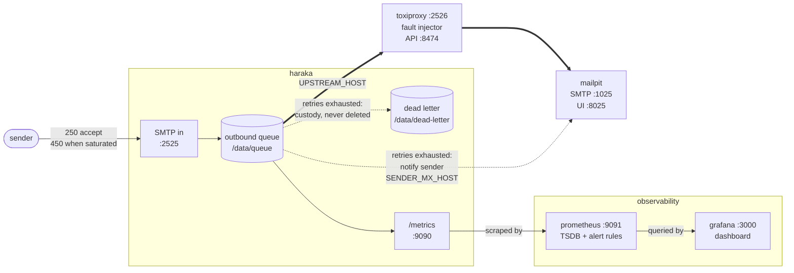

# Haraka relay with delivery-freshness observability

An inbound SMTP relay: it accepts mail on `:2525`, queues it through Haraka's
on-disk outbound queue, and forwards it to a configurable upstream. The
instrumentation is built around one question: is accepted mail reaching its
destination, and if not, how far behind are we? Prometheus and a provisioned
Grafana dashboard come up with the relay, alerts cover a freshness SLO plus a
durability invariant, and a toxiproxy switch in front of the upstream injects
slowness or an outage without any reconfiguration.

## Architecture

Five services in one `compose.yaml`, all bound to loopback. The thick line is
the normal relay path; dotted lines only carry traffic when the upstream stops
accepting mail.



Only the relay path crosses toxiproxy, so `fail.sh` breaks delivery without
touching anything else. The bounce notice skips it because in production an
NDR resolves by MX lookup to the sender's own provider, not the upstream we
relay into (see Design notes).

Mailpit takes two arrows because it plays both roles in this demo: the tenant's
mailbox provider and the sender's. Hence two env vars, `UPSTREAM_HOST` and
`SENDER_MX_HOST`, which in a real deployment point at different organisations.
"Sender" in this README means the connecting MTA when discussing back-pressure
and the message author when discussing bounces.

## Run it

```
docker compose up -d --build
```

The first build takes a minute or two. The stack also runs under podman with
the `docker compose` shim, and works on SELinux hosts (every bind mount
carries the `:Z` relabel flag).

This is an open relay by design, contained by the loopback binds and the fixed
upstream rather than by policy. The endpoints:

| Service                | URL                          | Notes                     |
|------------------------|------------------------------|---------------------------|
| SMTP in                | `localhost:2525`             | submit mail here          |
| Mailpit (upstream sink)| http://localhost:8025        | relayed mail + bounce notices |
| Grafana dashboard      | http://localhost:3000        | anonymous, no login       |
| Prometheus             | http://localhost:9091        | queries + alert state     |
| Haraka `/metrics`      | http://localhost:9090/metrics| raw exporter              |

If a host port is already taken, override the matching variable from `.env`:

```
PROMETHEUS_PORT=19091 docker compose up -d
```

## Send a test email

```
scripts/send-mail.sh
```

Or with curl directly (no mail client needed):

```
curl -s --crlf --url smtp://localhost:2525 \
  --mail-from sender@customer.example --mail-rcpt inbox@tenant.example \
  --upload-file - <<'EOF'
From: sender@customer.example
To: inbox@tenant.example
Subject: hello

test body
EOF
```

Or with swaks:

```
swaks --server localhost:2525 --from sender@customer.example --to inbox@tenant.example
```

## Verify it worked

The message lands in Mailpit at http://localhost:8025, or via its API:

```
curl -s localhost:8025/api/v1/messages | head -c 200
```

The counters move on the *Flow* panel of the dashboard, or read the exporter
directly:

```
curl -s localhost:9090/metrics | grep '^relay_'
```

On a healthy path `relay_received_total` and `relay_delivered_total` track each
other and `relay_dead_letter_depth` stays at `0`.

## Failure walkthrough

Start a steady drip in one terminal:

```
scripts/load.sh
```

**Slow upstream.** Inject 3s of latency on every upstream hop:

```
scripts/fail.sh slow
```

Delivery continues and nothing is rejected, but latency climbs: watch p95 rise
on the *Delivery latency* panel (panel 4). This is the failure mode the
freshness SLI is built to catch.

**Dead upstream.** Take it down entirely:

```
scripts/fail.sh down
```

The relay keeps accepting. Mail is already durably queued on disk, so it holds
rather than rejects. Queue depth and oldest-message age climb (panel 5),
deferrals accumulate under `reason="unreachable"` (panel 3; see Design notes on
why that label and not `refused`), and `MailDeliveryStalled` goes from pending
to firing on panel 1. In a real run it fired about 2.5 minutes into the outage.

Sends are not rejected during the outage. Rejection only begins past
`QUEUE_MAX_DEPTH` (200); panel 6 counts the 450s. That shedding is deliberate
(see Design notes), not a failure mode.

**Recovery.** Restore the upstream:

```
scripts/fail.sh reset
```

The queue drains on its 30s retry cycle, mail lands late but complete, and the
alert self-resolves. `scripts/fail.sh status` prints the current proxy state.

An end-to-end run of this sequence (healthy, slow, down, recover, at 5 msg/s)
accounts for every message:

| | |
|---|---|
| offered by `load.sh` | 672 |
| accepted (`relay_received_total`) | 652 |
| refused at RCPT (`relay_backpressure_rejections_total`) | 20 |
| delivered (`relay_delivered_total`) | 652 |
| lost | **0** |

The 20 refusals are the queue hitting `QUEUE_MAX_DEPTH` during the outage: a
tempfail before the `250`, not a loss. Deferrals peaked at 201
(`reason="unreachable"`), and the queue drained to empty on recovery.

**If the outage outlives the retry budget.** Past `RETRY_INTERVAL` (20
attempts, 30s apart, so ten minutes) Haraka permanently fails the message, and
two things happen that core would not do on its own. The message is not
deleted: `route_upstream` copies it to `DEAD_LETTER_DIR` first, where it stays
intact and replayable, and `MailDeadLettered` pages. The sender is also told: a
bounce notification goes back to them and lands in Mailpit. To watch both
without waiting ten minutes, shorten the budget:

```
RETRY_INTERVAL='5s*2' docker compose up -d --build   # ~10s to exhaustion
scripts/fail.sh down && scripts/send-mail.sh
sleep 35 && docker compose exec haraka ls /data/dead-letter
```

In a verification run of exactly that: the message was preserved with
`From`/`To`/`Subject` intact and the working queue empty, `relay_dead_letter_depth`
read `1`, `MailDeadLettered` fired, and Mailpit showed a `failure notice` from
`MAILER-DAEMON@relay.local` naming the original subject and reason.
`relay_delivered_total` stays `0` throughout: the notification is the relay's
own traffic and is kept out of the customer-flow metrics.

**If the sender cannot be reached either.** Stop Mailpit as well and both paths
are dead. The mail is still safe (`relay_dead_letter_depth` counts it,
`MailDeadLettered` pages), but `relay_ndr_failures_total` increments and
`SenderNotNotified` fires as a warning, because the sender is now sitting on a
`250` with no idea anything went wrong. That is the floor of this design: it
can always guarantee custody, it cannot always guarantee notification.

## SLIs and SLO

The relay has two jobs: move accepted mail to the upstream promptly, and never
lose it. They need different instruments. One is an SLO, the other an
invariant.

**SLI: delivery freshness.** The proportion of accepted messages handed to the
upstream within 60s of acceptance, taken from the
`relay_delivery_duration_seconds` histogram. The timer starts at acceptance, so
queue wait is included: a message stuck in the queue for five minutes is five
minutes late, however fast the eventual handoff.

**SLO: 99% of accepted messages delivered upstream within 60s, measured over
30 days.**

Freshness rather than an error rate because an inbound relay's failure mode is
mail sitting, not mail erroring: a slow upstream produces no errors at all, and
a dead upstream produces deferrals that are supposed to happen. One number
covers both, in the units the customer feels: at 5 msg/s sustained, an hour at
1% slow is roughly 180 noticeably late messages.

**Durability invariant (not an SLO): no accepted message is ever destroyed,
and the sender is never left with a false belief about it.** Mail that
exhausts its retry budget moves to a dead-letter queue instead of being deleted
(`relay_dead_letter_depth > 0` pages), and a bounce notification goes back to
the sender.

Durability is an invariant rather than an SLO because a ratio carries no usable
signal here. At 5 msg/s the relay handles ~13M messages a month, so even a
99.99% durability SLO would tolerate ~1,300 lost emails a month, plainly wrong
for mail, while the nines that would be acceptable cannot be distinguished
from 100% inside a 30-day window. A threshold event is the better instrument:
any dead letter is an incident, not budget burn.

"Never destroyed" is a narrower promise than "never lose an email", which no
MTA can make (Postfix gives up after five days). What SMTP forbids is accepting
a message (the `250` takes responsibility for it) and then dropping it with
nobody told. The relay allows two outcomes, deliver or refuse, and polices the
third: accept-then-vanish. Back-pressure tempfails at RCPT because declining
before the `250` is free; retry exhaustion dead-letters and bounces rather than
deleting. Custody is unconditional (a local disk write); notification is
best-effort (it is itself an email), which `SenderNotNotified` reports rather
than papers over.

## Alerts

```
MailDeliveryStalled: relay_queue_oldest_age_seconds > 60 for 1m        (severity: page)
MailDeadLettered:    relay_dead_letter_depth > 0                       (severity: page)
SenderNotNotified:   increase(relay_ndr_failures_total[5m]) > 0        (severity: warning)
MailLost:            increase(relay_dead_letter_failures_total[5m]) > 0 (severity: page)
```

In escalating order of meaning: mail is late, mail is stranded, the sender
doesn't know, mail is gone.

**MailDeliveryStalled** is the SLO alert, and it fires on queue *age* rather
than an error ratio. Age measures the SLI's pain in its own units (the oldest
customer mail is N seconds late), covers slow and dead upstreams with one rule,
and is rate-independent: ratio alerts are noisy at low traffic and blind at
zero, while queue age climbs with a single stuck message and falls as the queue
drains, so the alert self-resolves. The threshold is not hardcoded: the
Prometheus container substitutes it from `.env` into the committed
`prometheus/alerts.yml.tmpl` at start, so the demo retunes without editing
rules. The demo values (60s over 1m) fire fast enough to watch; production
would derive the threshold from the error budget and alert on burn rate.

**MailDeadLettered** is the invariant alert and is shaped differently: no
threshold and no `for:` clause, because one stranded message is already a
breach and there is nothing to debounce. It does not self-resolve; the gauge
only falls when a human drains the directory. Note the handoff during a long
outage: `MailDeliveryStalled` fires first while mail is merely late, and once
mail exhausts its retries the queue empties, that alert clears, and this one
takes over. Recovery of the first is not good news on its own.

**SenderNotNotified** stays a warning because when it fires the mail is safe
and `MailDeadLettered` is already paging for the same incident. What it adds is
that the sender believes delivery succeeded, which changes how you communicate
during the incident rather than who gets woken up.

**MailLost** covers the one path where mail genuinely disappears: the
dead-letter write itself failing (a full or unwritable disk). It should never
fire; if it does, the invariant is broken and the message is unrecoverable,
which is why it has its own rule.

Alert state is visible in Prometheus (`/alerts`) and on panel 1 of the
dashboard.

## Design notes

**Degradation: accept, queue, retry; tempfail only under saturation.** While
healthy the relay owns durability: mail goes to the disk queue and brief
upstream blips are invisible to the sender. Once the queue passes
`QUEUE_MAX_DEPTH`, new recipients get a 450 at RCPT, which pushes durability
back onto the sender's MTA; a real sender like Exchange Online holds and
retries for up to a day (its message expiration timeout defaults to 24 hours
and cannot be raised). Better to hand mail back explicitly than accept mail we
might lose. Past the retry budget the message is dead-lettered, never deleted,
so the `250` is always honoured by something: delivery, an explicit refusal,
or a preserved copy plus a page.

**Surviving retry exhaustion: why the bounce hook does two jobs.** When a
message runs out of retries, Haraka fires `hook_bounce`. Both of the obvious
responses destroy the mail:

- *Suppress the bounce* (return non-CONT): Haraka calls `discard()`, which
  deletes the queue file. The mail is gone and the sender is never told.
- *Allow the bounce* (return CONT): Haraka deletes the original and queues a
  bounce notice to the sender. The notice is just another outbound email, so
  our own `hook_get_mx` routes it to the same upstream whose outage caused the
  failure. The notice fails too, exhausts its own retries, and because a
  bounce cannot itself bounce (it has an empty return path), Haraka's
  `double_bounce()` deletes it. The mail is gone and the sender is still
  never told.

So the plugin does two things. `hook_bounce` copies the message into the
dead-letter directory *before* returning CONT, taking custody before Haraka
can delete anything. And `hook_get_mx` routes bounce mail (recognised by its
empty return path) to `SENDER_MX_HOST` instead of the upstream, so the notice
does not depend on the very system whose failure it reports.

Routing NDRs around toxiproxy corrects a distortion the demo introduced rather
than dodging the failure: in production an NDR resolves by MX lookup to the
sender's provider, which has no relationship to the upstream we relay into.
`SENDER_MX_HOST` restores the topology reality would provide. The dead-letter
queue remains the backstop for the case production shares: an NDR that cannot
be delivered either.

**Toxiproxy is the test harness, not the architecture.** The serving path runs
straight from Haraka to the upstream. Toxiproxy sits in the wiring only so a
reviewer can inject failure from a script. A production-shaped path is one env
change: `UPSTREAM_HOST=mailpit UPSTREAM_PORT=1025`.

**Metrics plugin: built, not reused.** I evaluated
`@mailprotector/haraka-plugin-prometheus`: no
latency histogram, no queue gauges, no labels, a counter per hook across ~28
hooks that no incident would ever consult, and a duplicate-metric-registration
bug in its notes-based extension path. I kept its one good idea, serving
`/metrics` from Haraka's `init_http` hook, and instrumented only what gets
looked at during an incident: flow balance, deferrals by reason,
accept-to-handoff latency, and queue depth/age.

**Why `unreachable`, not `refused`.** Haraka's `deferred` hook does
not receive the socket error when the upstream refuses connections; after MX
exhaustion it gets the string `Tried all MXs`. A naive `reason="refused"` label
would never fire during a real outage. The plugin buckets these as
`reason="unreachable"`, because at that hook connect-refused and
connect-timeout are indistinguishable, and a dashboard should not pretend
otherwise. The regexes still catch SMTP-level 4xx/5xx errors that carry a code.

**Telemetry backend: buy, not build.** The relay produces the same ~40 series
busy or idle, so message volume is not the cost driver; cardinality is. That
means bounded `reason` labels and no per-tenant or per-message labels unless
per-tenant becomes a deliberate, budgeted exception. A lone SRE's time is
better spent on the relay than on operating a time-series database: buy
managed (Grafana Cloud, AMP + AMG, or Datadog) and self-host only when data
residency or per-series pricing at real scale forces it. Because the
dashboards and alert rules are code, the same ones ship to either backend;
this repo is the portable part.

**Production shape on AWS.**

- **Compute / routing.** NLB in front of a per-region Fargate service running
  the Haraka task.
- **Durability.** The sender is EXO, itself a durable queue: tempfailed mail
  is held and retried at Microsoft, so a dead task forfeits at most
  `QUEUE_MAX_DEPTH` accepted messages (40 seconds of mail at 5 msg/s), and a
  SIGTERM drain inside Fargate's `stopTimeout` closes even that for routine
  deploys. Dead letters are the one state that must outlive the task; they go
  to S3.
- **Telemetry.** ADOT or CloudWatch-agent sidecar scrapes `:9090` into Amazon
  Managed Prometheus (per-region workspaces, one global Grafana). Alert rules
  live in the AMP ruler.
- **IaC / multi-region.** Active/active MX with per-region alerting so a stall
  pages that region's on-call. Terraform provisions from this repo's committed
  configs as the source of truth.

**Demo values, except `nodes=1`.** Retry is `30s*20` then
bounce, versus exponential backoff over days. Scrape is 5s, versus 15-60s. The
alert thresholds are demo-shaped too; the Alerts section covers how. The
precondition is `nodes=1`: the in-process prom-client registry and the
directory-scan queue counts are only coherent in a single process. Production
scales horizontally and aggregates across instances in Prometheus.

## Limitations

- **Delivery is at-least-once, not exactly-once.** A message the upstream
  accepted but did not confirm is retried and can arrive twice; the E2E run
  above duplicated 13 of 652 at the outage boundary. The alternative to a
  duplicate is a loss, so de-duplication is the receiver's job, on `Message-Id`.
- **Dead letters need a human, and there is no replay tooling.** The preserved
  files are Haraka queue files (todo header + message), so replaying means
  copying them back into the queue dir. Fine for one message, tedious for a
  hundred.
- **Back-pressure covers queue depth, not queue age.** At low traffic a long
  outage never approaches the depth limit, so mail is accepted right up until
  it dead-letters. Survivable now that nothing is destroyed, but a tempfail
  on queue age would be the natural complement.
- **Back-pressure admits on stale state.** The depth check at RCPT reads a 2s
  TTL-cached directory scan (shared with the queue gauges), so
  `QUEUE_MAX_DEPTH` is enforced approximately: a couple of seconds of traffic
  can slip past the limit before the next scan. Flow counters can also skew on
  multi-recipient-domain messages (`received` is per transaction, `delivered`
  per recipient-domain). Both are fine at this scale and against a single
  sink.

## Next steps

- `scripts/replay.sh` to drain the dead-letter queue back into the outbound
  queue. The invariant guarantees the mail still exists; recovering it should
  be pleasant too.
- An `absent()` / `up == 0` dead-scrape alert. A stalled exporter currently
  looks healthy, which is the classic monitoring blind spot.
- Tempfail on queue age as well as depth, so a long outage sheds load back to
  senders before the retry budget runs out.
- CI: shellcheck the scripts, `docker compose config` validation, and a smoke
  test that sends one message and asserts the counter moved.
- Fix multi-recipient-domain flow accounting so the counters balance exactly.
